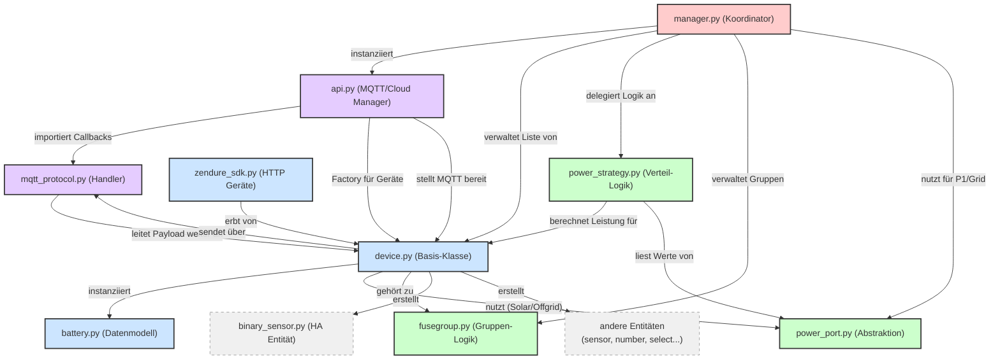

Hier ist ein Diagramm (als Mermaid-Code), das die Architektur und die Abhängigkeiten der bereitgestellten Dateien visualisiert.

Es zeigt, wie der `manager` die zentrale Rolle einnimmt, der `api` die Kommunikation übernimmt und die `device`-Klassen die physischen Geräte repräsentieren.

### Erklärung der Schichten

Das Diagramm ist in vier logische Bereiche unterteilt:

1.  **Koordinator (Rot):**
    *   **`manager.py`**: Das Herzstück. Es erbt vom Home Assistant `DataUpdateCoordinator`. Es lädt beim Start die Geräte, überwacht den P1-Stromzähler und entscheidet, wann geladen oder entladen werden soll.

2.  **Kommunikation (Lila):**
    *   **`api.py`**: Hält die MQTT-Verbindungen (Cloud und Local). Es verwaltet das Gerät-Dictionary und leitet eingehende MQTT-Nachrichten weiter.
    *   **`mqtt_protocol.py`**: Enthält die reine Logik zum Parsen von JSON-Nachrichten und das Routing an die richtigen Geräte-Methoden (z.B. `on_msg_cloud`).

3.  **Geräte-Kern (Blau):**
    *   **`device.py`**: Die Hauptklasse `ZendureDevice`. Sie verwaltet den Zustand (State), Entitäten (Sensoren) und die Verbindungsinformationen.
    *   **`zendure_sdk.py`**: Spezialisierte Klasse für Geräte, die das lokale "ZenSDK" (HTTP) unterstützen. Erbt von `device.py`.
    *   **`battery.py`**: Hilfsklasse zur Darstellung von Batterie-Packs, die an ein Gerät angeschlossen sind.

4.  **Logik & Strategie (Grün):**
    *   **`power_strategy.py`**: Enthält die komplexe Mathematik, um决定 (zu entscheiden), wie viel Leistung auf welche Geräte verteilt wird (basierend auf SOC, Limits und PV-Leistung). Wird vom Manager aufgerufen.
    *   **`fusegroup.py`**: Verwaltung von Gerätegruppen, um sicherzustellen, dass die Summe der Leistung einer Gruppe nicht bestimmte Grenzen überschreitet.
    *   **`power_port.py`**: Abstraktionsschicht. Sie definiert, was ein "Eingang" oder "Ausgang" ist (z.B. Grid-Port, Solar-Port). Dies hilft dem Manager und der Strategie, Geräte einheitlich zu behandeln.

### Wichtige Abhängigkeiten

*   **Kreisbezug API <-> Device:** Der `api` erstellt die Geräte (`Device`), aber das `Device` benötigt den `api` wiederum, um MQTT-Nachrichten zu senden.
*   **Trennung von Logic und State:** Der `Manager` weiß *was* zu tun ist (z.B. "alle Geräte entladen"), die `power_strategy` weiß *wie* viel, und das `device` weiß *wie* der Befehl technisch gesendet wird (via `mqtt_protocol`).
*   **Entitäten:** Dateien wie `binary_sensor.py` (und andere nicht gezeigte wie `sensor.py`, `number.py`) hängen stark von `device.py` ab, da sie dort instanziiert werden.